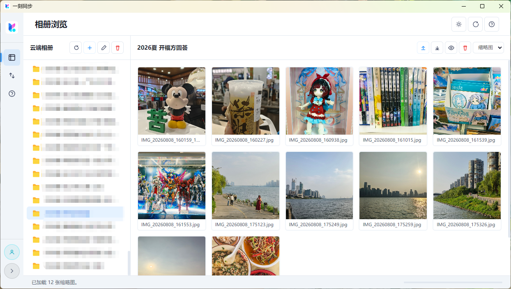
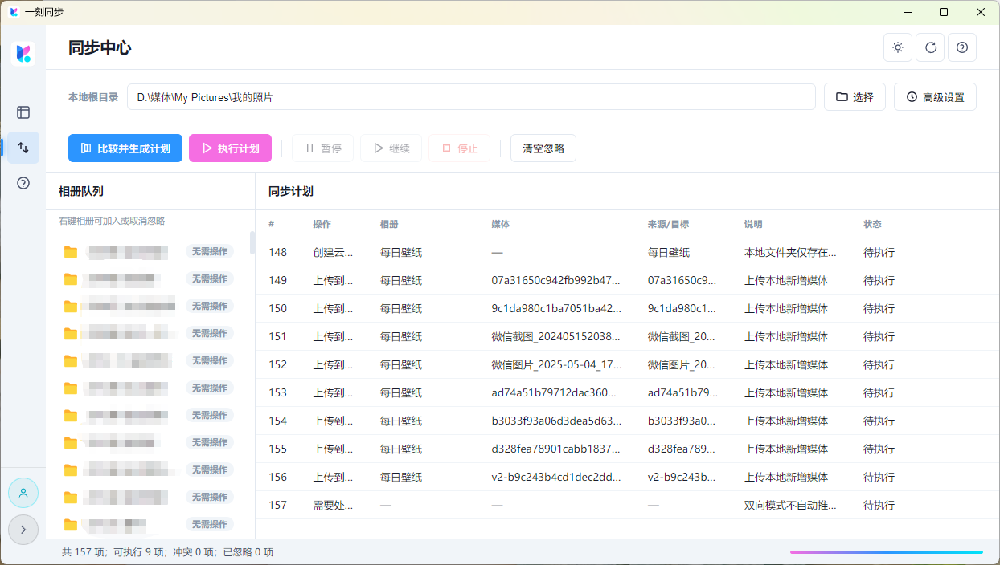
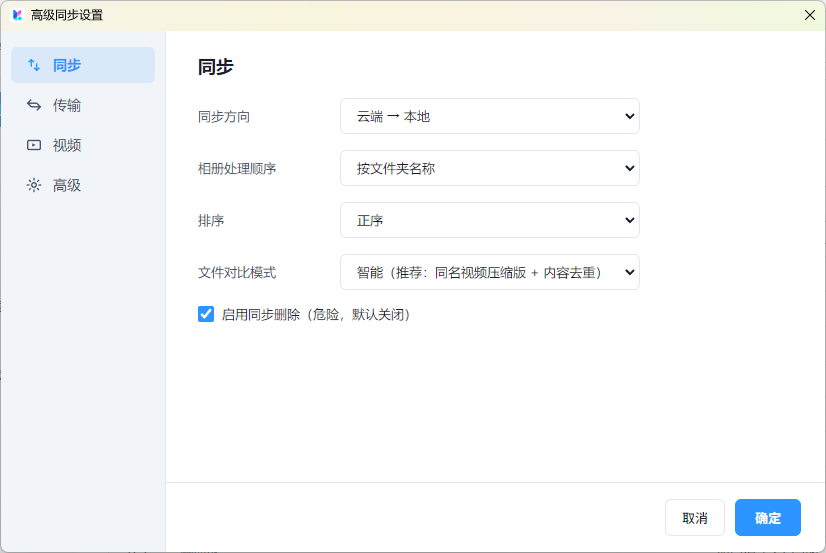
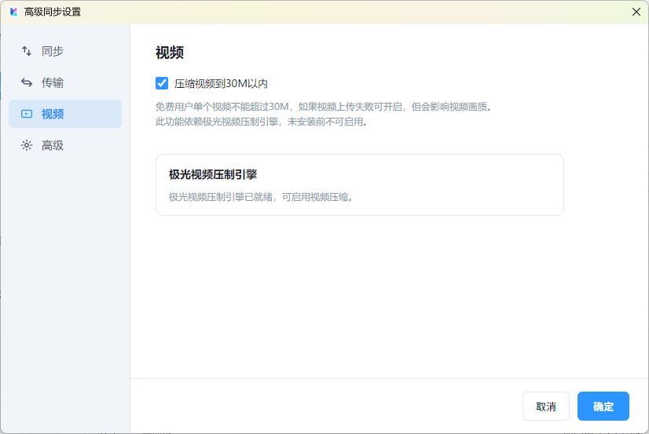

<h1 align="center">一刻相册同步助手</h1>
<p align="center">
  
</p>
<p align="center">
  基于百度网盘「一刻相册」公开接口的跨平台桌面照片/视频同步工具 📷🔄
</p>
<p align="center">
  非官方项目，与百度网盘及一刻相册无任何官方关联或背书
</p>

<table>
  <tr>
    <td width="50%" align="center">
      
    </td>
    <td width="50%" align="center">
      
    </td>
  </tr>
  <tr>
    <td width="50%" align="center">
      
    </td>
    <td width="50%" align="center">
      
    </td>
  </tr>
</table>

---

## ✨ 特色功能

- 🔄 **多模式同步**：支持「本地 → 云端」「云端 → 本地」「双向」三种同步方向
- ⚡ **多线程加速比对**：比对阶段通过 `worker_threads` 线程池并行计算文件 MD5，显著提升大批量媒体比对速度（并发数随 CPU 核数自动取值，可手动调整）
- 🧠 **智能内容去重**：同名视频按云端压缩版视为已同步；同名非视频文件按大小 + MD5 内容签名去重，避免重复上传/下载（含服务端自动改名或本地重复副本）
- 🆕 **双向新覆盖旧**：双向同步时，若同名文件内容不同，按创建日期判定——较新版本覆盖较旧版本，保证两端最终一致
- 🗂️ **忽略列表**：右键相册即可加入/移除忽略列表，直接作用于已生成的同步计划，**无需重新扫描**本地与云端
- 🗑️ **删除策略**：云端 → 本地方向勾选删除后，本地多余相册及其媒体会进入删除任务；双向模式不自动推断删除意图，避免误删
- 🎞️ **超限视频压缩上传**：普通用户单文件超过 30MB 限制时，可自动压缩至 28MB 以内后以原文件名上传，本地高清原件保留
- ⏯️ **同步控制**：支持暂停 / 继续 / 安全停止；遇「操作过于频繁」（errno 50005）自动暂停并提示
- 🔐 **隔离上传客户端**：每个上传任务使用独立子进程文件客户端，异常隔离、失败自动重试

## 运行与构建

本项目为 Electron 桌面应用，源码即产品：

```bash
# 安装依赖
npm install

# 开发模式运行
npm run dev

# 生产模式运行
npm start
```

最低环境要求：

-  Windows 10 / 11
-  macOS 12+
-  主流 Linux 发行版

> 使用需在设置中导入有效的百度网盘登录 Cookie（BAIDUID / BDUSS），仅用于调用个人账户授权下的公开接口。

### 同步流程简述

1. **生成计划**：扫描本地根目录与云端相册快照，按相册并行比对，生成同步动作列表（上传 / 下载 / 创建相册 / 删除 / 冲突 / 跳过）。
2. **执行计划**：串行创建相册 → 并发上传（按相册分组、大文件独占通道）→ 并发下载 → 串行收尾。
3. **结果与状态**：每项动作实时反馈状态（待执行 / 正在执行 / 已完成 / 已跳过 / 失败），可随时暂停或停止。

## ⚖️ 法律声明与使用限制

- 本项目仅供学习与研究使用，禁止任何形式的商业用途（包括但不限于销售、收费服务、广告变现、商业集成等）。
- 本项目与百度网盘 / 一刻相册无任何官方关联或背书，不使用其商标与标识；涉及的名称与商标归其权利人所有。
- 数据来源于用户调用的公开接口与个人账户授权；使用时需遵守百度网盘的《用户协议》《社区规则》及相关法律法规。
- 禁止绕过登录 / 会员权限、DRM / 加密措施，或进行批量爬取、恶意抓取等违反平台规则的行为。
- 同步操作会真实地增删本地与云端文件，请在执行前确认同步方向与删除策略，重要数据建议提前备份。

## 🙏 鸣谢

- 感谢 [HengyueLi/baiduphoto](https://github.com/HengyueLi/baiduphoto) 对百度网盘「一刻相册」接口的长期整理与开源，为本项目接口封装提供了重要参考。
- 感谢所有提出 Issue 与反馈的使用者，帮助持续完善同步引擎的稳定性与正确性。

---

如果你觉得这个项目有用，欢迎 ⭐️ Star 支持，也欢迎通过 Issue 交流反馈 🙌
