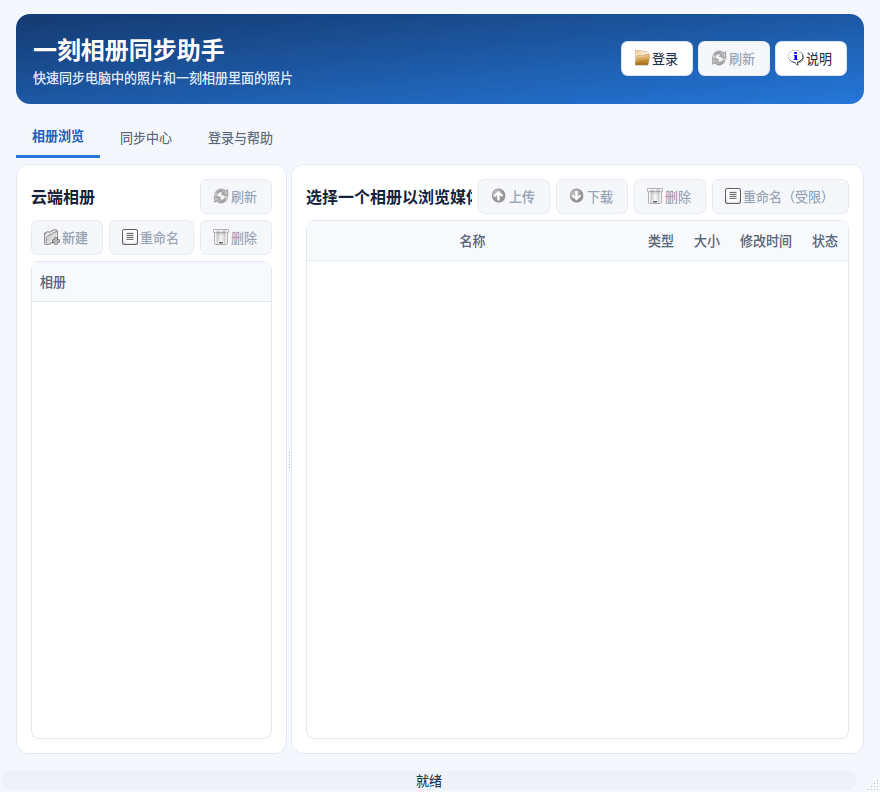
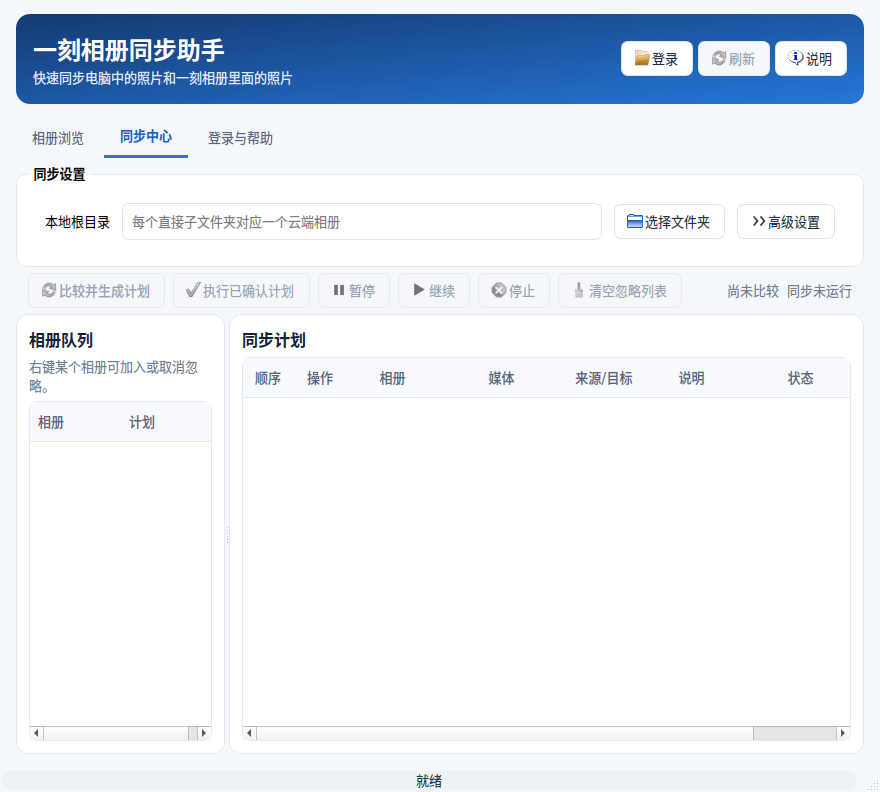
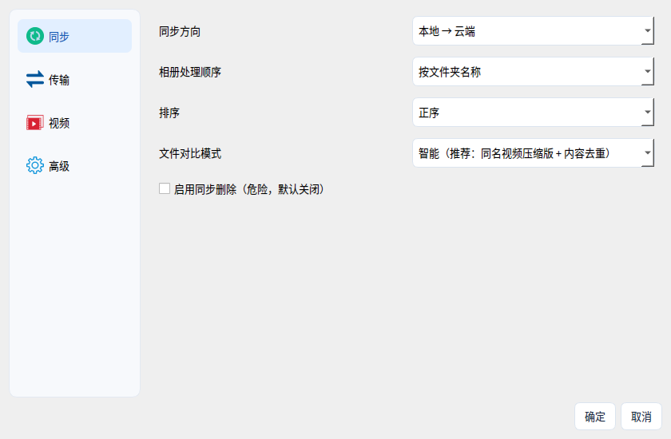

# Baidu Photo Sync

A desktop application for synchronizing local photo folders with Baidu Photo albums. The application provides a visual album browser, conservative sync planning, background transfer controls, optional video compression, and a built-in QR-code sign-in flow.

> This project is intended for accounts and media that you are authorized to access. Review every generated sync plan before executing it, especially when deletion is enabled.

## Highlights

| Area | Capability |
| --- | --- |
| Album browser | Browse cloud albums and media, then create, rename, delete, upload, or download from one desktop interface. |
| Sync planner | Map local folders to cloud albums, compare content, produce an explicit plan, and control execution with pause, resume, and stop actions. |
| Safe defaults | Keep destructive synchronization disabled by default and surface file conflicts before any transfer begins. |
| Video handling | Optionally create a temporary upload copy for oversize video files while keeping the local original unchanged. |
| Account session | Use an in-app Baidu QR-code sign-in page and keep the validated local session scoped to the current Windows user. |
| Windows releases | Choose a standard executable that downloads FFmpeg only when needed or an executable that already includes it. |

## Download and Use

Download the newest Windows executable from [GitHub Releases](https://github.com/xRetia/BaiduPhotoSync/releases/latest). Two x64 variants are available so that you can choose the most suitable trade-off.

| Asset | Recommended for | FFmpeg behavior |
| --- | --- | --- |
| `BaiduPhotoSync-<version>-Windows-x64.exe` | Most users who do not need video compression immediately. | The smaller executable downloads and validates FFmpeg only after video compression is enabled. |
| `BaiduPhotoSync-<version>-Windows-x64-with-ffmpeg.exe` | Offline environments or users who need video compression from first launch. | Includes `ffmpeg.exe` and `ffprobe.exe` inside the executable package. |

Run the downloaded `.exe` file, select **Sign In**, and complete the QR-code confirmation in the official Baidu page. After the account is connected, select a local root directory in **Sync Center**, create a plan, inspect the listed actions, and run only the confirmed plan.

## Screenshots

### Album Browser

### Sync Center

### Sign-in and Help

### Advanced Settings

## Workflow

The application is designed around an inspect-first workflow. Connect an account, select a local folder, generate a comparison plan, and review all proposed actions before running them. The Sync Center separates the album queue from the planned operations so that progress and pending work remain visible.

| Step | Action | Result |
| --- | --- | --- |
| 1 | Connect the account through QR-code sign-in. | The application can retrieve the accessible album list. |
| 2 | Select a local root directory in Sync Center. | Each direct child folder can be matched with a cloud album. |
| 3 | Choose **Compare and Build Plan**. | The application creates a reviewable list of proposed operations. |
| 4 | Review the queue, conflict details, and any skipped files. | You decide whether the proposed work is acceptable. |
| 5 | Choose **Run Confirmed Plan**. | The application performs only the approved operations. |

## Video Compression and FFmpeg

Video compression is optional and disabled by default. When enabled, the application prepares a temporary compressed upload copy for an oversize video and retains the original local file. The standard executable downloads the required Windows FFmpeg tools only after the option is used; the bundled variant contains those tools from the start. The downloadable FFmpeg archive is obtained from the official BtbN build release and checked against its published SHA-256 checksum before installation.[1]

## Privacy and Data Handling

The QR-code flow is displayed in the application rather than requiring a separate browser. A validated local sign-in session is kept for the current Windows user, and the project does not intend to write cookies to application logs. Treat any local session as sensitive and use the application only on a trusted Windows account.

## Build from Source

The repository includes a GitHub Actions workflow that creates both Windows x64 executable variants from the tagged source. For a local Windows build, install Python, install the dependencies in `requirements.txt` together with PyInstaller, and invoke the release build script. The workflow uses the vendored `pybaiduphoto` implementation and packages the application assets, the embedded browser runtime, and the required Python modules.

| Build option | Command | Output |
| --- | --- | --- |
| Standard | `powershell -ExecutionPolicy Bypass -File scripts\build-windows-release.ps1` | `BaiduPhotoSync-<version>-Windows-x64.exe` |
| Bundled FFmpeg | `powershell -ExecutionPolicy Bypass -File scripts\build-windows-release.ps1 -WithFFmpeg` | `BaiduPhotoSync-<version>-Windows-x64-with-ffmpeg.exe` |

## Support and Responsible Use

This is an independent desktop client. It is not an official Baidu product. Please comply with the applicable Baidu service terms, protect your account credentials, and avoid running deletion-enabled synchronization without verifying the generated plan.

## References

[1] [BtbN FFmpeg-Builds release assets](https://github.com/BtbN/FFmpeg-Builds/releases/latest)
